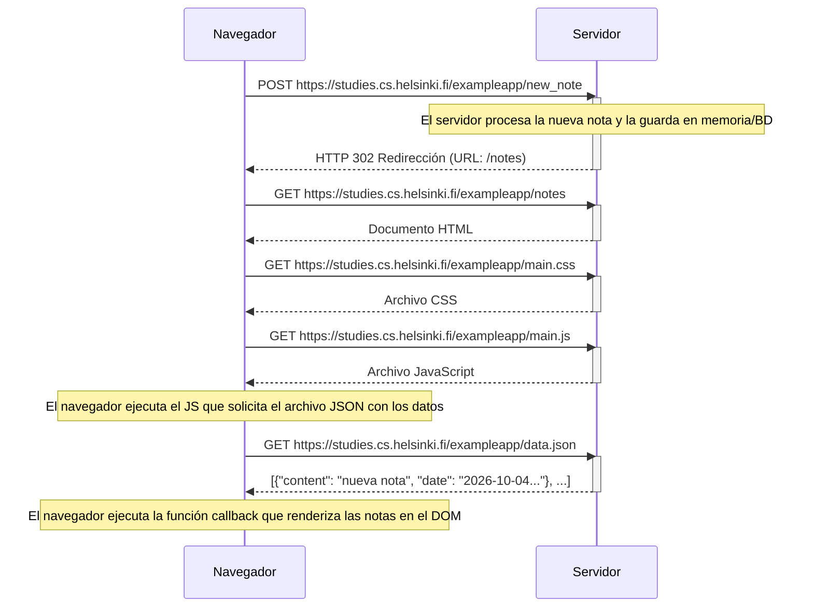
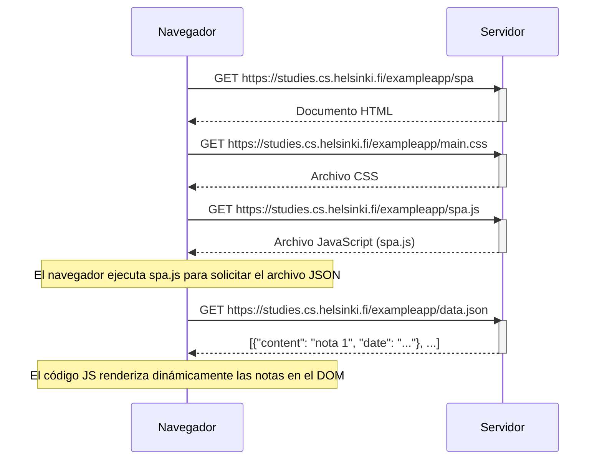
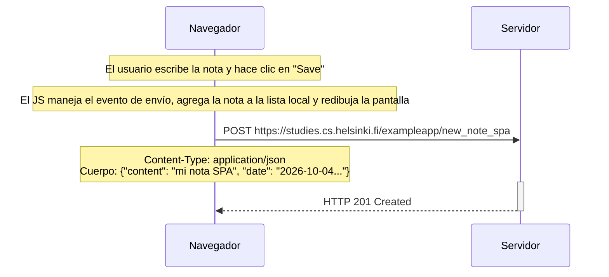

### Ejercicio 0.4: Nueva nota en diagrama de aplicación tradicional

### Ejercicio 0.5: Diagrama de aplicación de una sola página (SPA)

### Ejercicio 0.6: Nueva nota en diagrama de aplicación de una sola página (SPA)

